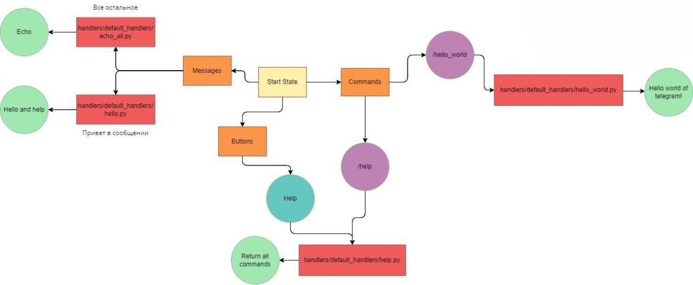

# Бот для покупки авиабилетов
## Функции:
- Ответ на приветствие: если в сообщении есть "Привет", то отвечает "Здравствуй (имя пользователя)! Чтобы узнать все доступные комманды введите /help"
- Эхо: если не чат не находится ни в каком состоянии, то отвечает таким же сообщением
- Команда /help: пишет в чат все имеющиеся команды и их описания (редактируется в config_data/config.py)
- Команда /hello_world: пишет в чат "Hello world of telegram!"

## Пройденные этапы разработки:
- [x] 1 Создание бота, который реагирует на команду /hello-world, а также на текст «Привет»
- [ ] 2 Реализация команды /low
- [ ] 3 Реализация команды /high
- [ ] 4 Реализация команды /custom
- [ ] 5 Реализация команды /history
- [ ] 5.1 Добавление всяких мелких плюшек и вспомогательного функционала
- [ ] 6 Сдача готового проекта

## Структура бота:
