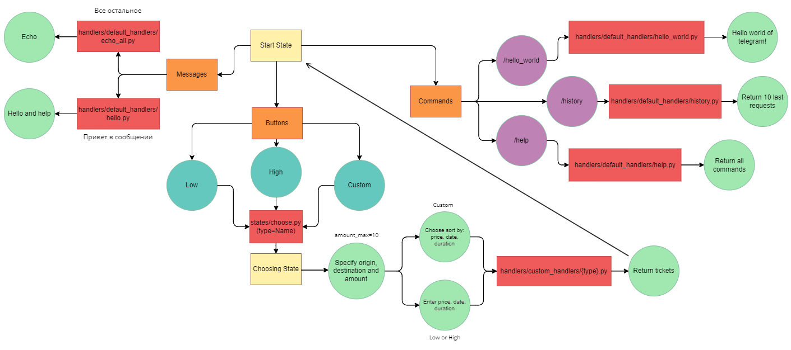

# Бот для покупки авиабилетов
## Оглавление:
- [Функции](#функции)
- [Пройденные этапы разработки](#пройденные-этапы-разработки)
- [Работа с endpoint API](#работа-с-endpoint-api)
- [Структура бота](#структура-бота)

## Функции:
- Ответ на приветствие: если в сообщении есть "Привет" или "/start", то отвечает "Здравствуй (имя пользователя)! Чтобы узнать все доступные команды введите /help" и переводит в состояние "start"
- Эхо: если чат не находится ни в каком состоянии, то отвечает таким же сообщением
- Команда /help: пишет в чат все имеющиеся команды и их описания (редактируется в config_data/config.py)
- Команда /hello_world: пишет в чат "Hello world of telegram!"
- Команда /menu: выводит доступные кнопки с действиями
- Кнопка Low(state=start): Переводит в состояние настройки поиска билетов с фильтрацией по возрастанию(state=request_state)
- Кнопка High(state=start): Переводит в состояние настройки поиска билетов с фильтрацией по убыванию(state=request_state)
- Кнопка Custom(state=start): Переводит в состояние настройки поиска билетов с настраиваемой фильтрации(state=request_state_custom)

## Пройденные этапы разработки:
- [x] 1 Создание бота, который реагирует на команду /hello-world, а также на текст «Привет»
- [x] 2 Реализация команды /low (http://api.travelpayouts.com/v2/prices/month-matrix; price, date, trip_duration)
- [x] 3 Реализация команды /high (http://api.travelpayouts.com/v2/prices/month-matrix; price, date, trip_duration)
- [x] 4 Реализация команды /custom (http://api.travelpayouts.com/v2/prices/month-matrix; price, date, trip_duration)
- [ ] 5 Реализация команды /history 
- [ ] 5.1 Добавление всяких мелких плюшек и вспомогательного функционала
- [ ] 6 Сдача готового проекта

## Работа с endpoint API:
### Пример запроса: 
https://api.travelpayouts.com/v2/prices/month-matrix?currency=rub&origin=TJM&destination=SVO&show_to_affiliates=true&token={TOKEN}
### Результат запроса сокращенный до 1 элемента:
```
{
    "data": [
        {
            "depart_date": "2024-03-03",
            "origin": "TJM",
            "destination": "MOW",
            "gate": "MEGO.travel",
            "return_date": "",
            "found_at": "2024-02-02T11:00:31Z",
            "trip_class": 0,
            "value": 3842,
            "number_of_changes": 0,
            "duration": 175,
            "distance": 1704,
            "show_to_affiliates": true,
            "actual": true
        }
    ],
    "currency": "rub",
    "success": true
}
```
## Структура бота:

